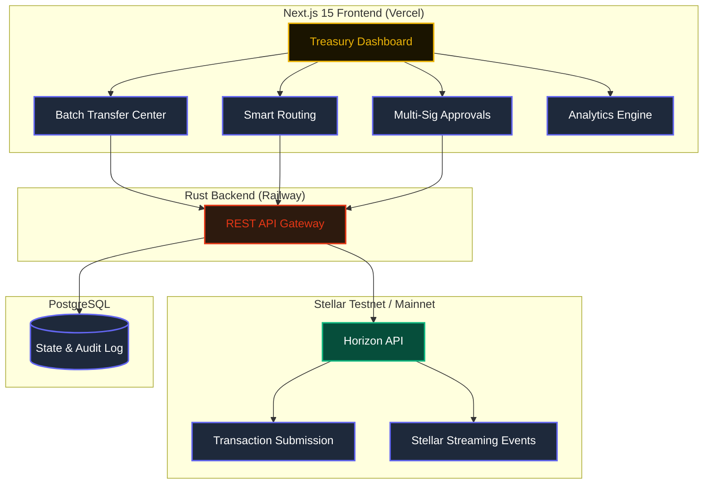
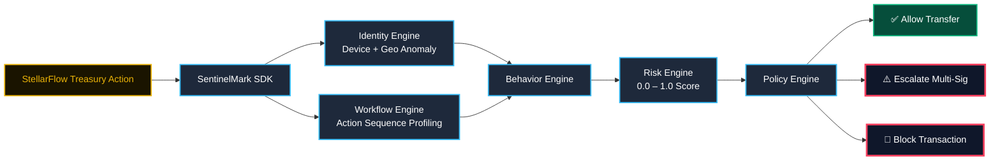

<h1 align="center">
  
</h1>

<p align="center">
  
</p>

<p align="center">
  <a href="https://nextjs.org/"></a>
  <a href="https://www.rust-lang.org"></a>
  <a href="https://stellar.org/"></a>
  <a href="https://www.postgresql.org/"></a>
  
  
  <a href="https://web3-private-production.up.railway.app/"></a>
</p>

<p align="center">
  <a href="https://web3-private-production.up.railway.app/">
    
  </a>
</p>

---

## 📌 What is StellarFlow?

Managing a corporate treasury on a traditional bank dashboard is like piloting a jumbo jet with a bicycle bell. It was never designed for the speed, transparency, or programmability that Web3 demands.

**StellarFlow** was built to close that gap.

It is a **full-stack, enterprise-grade Treasury Operating System** that lives natively on the Stellar blockchain. StellarFlow unifies every treasury workflow — from single-click batch payouts to threshold-based multi-sig governance — into a single, beautifully designed operations center.

> The goal is simple: give treasury teams the clarity of a Bloomberg terminal, the control of a smart contract, and the mobility of a mobile banking app — all in one place.

---

## ⚡ Performance & Efficiency

The following metrics demonstrate StellarFlow's transactional throughput advantages over traditional treasury pipelines:

<p align="center">
  
</p>


---

## 🌟 Core Features

<table>
<tr>
<td width="50%">

### 💸 Batch Transfers
Execute **thousands of disbursements** in a single atomic transaction. Perfect for payroll, dividends, and airdrop distributions at near-zero cost.

- Parallel transaction construction
- Atomic multi-payment bundles
- CSV / JSON import support
- Real-time status monitoring

</td>
<td width="50%">

### 🧭 Smart Routing
AI-assisted pathfinding that automatically discovers the **most capital-efficient route** across Stellar's DEX for any cross-currency settlement.

- Multi-hop path discovery
- Slippage protection
- Live price oracle integration
- Admin-key copy for demos

</td>
</tr>
<tr>
<td width="50%">

### 🔐 Multi-Sig Governance
Enforce **threshold-based signing** requirements on every high-value action. No single key can unilaterally move funds.

- N-of-M signature thresholds
- Approval queues with TTLs
- On-chain quorum verification
- Full audit trail per proposal

</td>
<td width="50%">

### 📊 Intelligence Analytics
Live treasury dashboards delivering **institutional-grade visibility** into cash positions, velocity, and network health.

- Rolling P&L and cash flow
- Asset concentration metrics
- Horizon event stream feed
- Exportable compliance reports

</td>
</tr>
</table>

---

## 🏗️ System Architecture

<div align="center">



</div>

---

## 🔮 Future Roadmap: SentinelMark SDK Integration

The next evolution of StellarFlow will integrate **[SentinelMark](https://github.com/Be-bibek/sentinelmark)** — a **Behavior-Aware Continuous Trust Infrastructure Platform** built in Rust.

Traditional multi-sig says: *"Was the right key used?"*  
SentinelMark asks: **"Can this treasury operator still be trusted right now?"**

By embedding the `sentinelmark-rs` SDK into StellarFlow's Rust backend, every high-value treasury action will pass through a 7-engine deterministic trust evaluation pipeline before being authorized on-chain.

### The Integration Flow

<div align="center">



</div>

### What Each Engine Does for StellarFlow

| SentinelMark Engine | StellarFlow Use Case |
|---|---|
| **Identity Engine** | Detects if the treasury manager signs from a new device or impossible-travel location. |
| **Workflow Engine** | Flags if batch exports are submitted outside normal operational hours or approval flow. |
| **Behavior Engine** | Builds a rolling profile of typical transaction volumes, currencies, and counterparties. |
| **Risk Engine** | Converts behavioral deviations into a deterministic `0.0–1.0` risk score. |
| **Trust Engine** | Inverts risk into an actionable Trust Score driving policy enforcement. |
| **Policy Engine** | Enforces: `Allow`, `RequireMFA`, `RequireApproval`, or `Block` on the treasury action. |
| **Explainability Engine** | Generates compliance-ready narratives: *"Transfer blocked: 3.2σ geo anomaly detected."* |

### Future SDK Usage Preview

```rust
use sentinelmark_rs::SentinelMark;
use telemetry_engine::{TelemetryEvent, ActionType};

// Initialize the continuous trust SDK inside StellarFlow's Rust backend
let engine = SentinelMark::new();

// A treasury operator attempts a $500,000 batch payout from an unknown region
let event = TelemetryEvent {
    user_id: UserId("treasury-admin-001".to_string()),
    action_type: ActionType::BatchTransfer,
    transaction_amount: Some(500_000.0),
    geo_region: "RU-Moscow".to_string(), // Unusual region for this operator
    // ... timestamps, device_id, IP fingerprint
};

// SentinelMark evaluates trust deterministically against historical profile
let result = engine.evaluate(&event, &historical_profile);

println!("Decision: {:?}", result.decision);
// → RequireApproval  (Auto-escalated to Multi-Sig threshold)

println!("Explanation: {}", result.explanation);
// → "Risk score: 0.72. Geo anomaly (4.1σ deviation). Unusual transaction volume."
```

This integration turns StellarFlow's multi-sig approvals from a **static rule** into a **dynamic, behavior-aware shield**.

---

## 🛠️ Tech Stack

<table>
<tr><th>Layer</th><th>Technology</th><th>Role</th></tr>
<tr><td>Frontend</td><td>Next.js 15, React 19, TailwindCSS v4</td><td>Treasury Dashboard UI, PWA</td></tr>
<tr><td>Animations</td><td>Framer Motion, GooeyNav</td><td>Micro-animations, mobile nav</td></tr>
<tr><td>Backend</td><td>Rust (Axum), Tokio async runtime</td><td>API Gateway, transaction orchestration</td></tr>
<tr><td>Database</td><td>PostgreSQL (SQLx pool)</td><td>State, approvals, audit ledger</td></tr>
<tr><td>Blockchain</td><td>Stellar SDK, Horizon API</td><td>Signing, pathfinding, streaming</td></tr>
<tr><td>Deployment</td><td>Railway (Backend), Vercel (Frontend)</td><td>CI/CD, auto-deploy on push</td></tr>
<tr><td>Trust (Future)</td><td>SentinelMark Rust SDK</td><td>Behavioral continuous trust</td></tr>
</table>

---

## 📦 Getting Started

### Prerequisites
* **Node.js** 22+ & npm
* **Rust** 1.75+
* **Docker & Docker Compose** (for local PostgreSQL)

### Installation

```bash
# 1. Clone the repository
git clone https://github.com/Be-bibek/web3-private.git
cd web3-private

# 2. Install frontend dependencies and start dev server
npm install
npm run dev
# → App live at http://localhost:3000

# 3. Start the Rust backend (separate terminal)
cd backend
cargo run
# → API listening at http://localhost:8080

# 4. (Optional) Start PostgreSQL via Docker
docker-compose up -d
```

---

## 🎓 Author

**Bibek Das**  
* B.Tech Scholar, **Electronics and Communication Engineering (ECE)**  
* **Guru Nanak Institute of Technology**
* Email: [bibekdas1055@gmail.com](mailto:bibekdas1055@gmail.com)  
* GitHub: [@Be-bibek](https://github.com/Be-bibek)  

* 🌐 Live App: [web3-private-production.up.railway.app](https://web3-private-production.up.railway.app/)

---

<div align="center">
  
</div>
