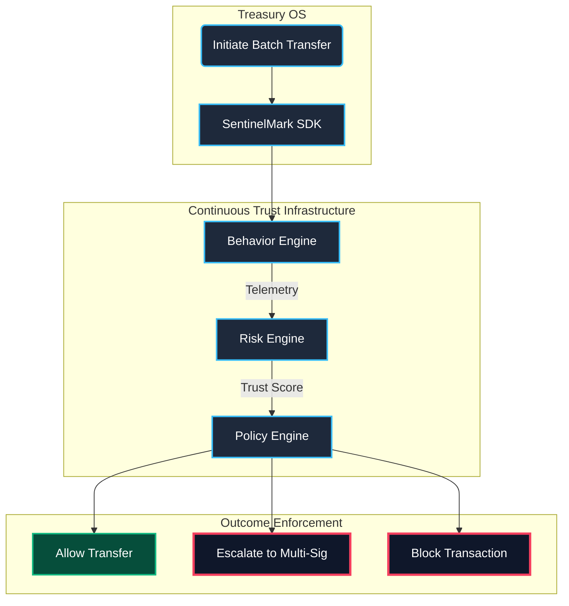

<h1 align="center">
  
</h1>

<p align="center">
   
</p>

<p align="center">
  <a href="https://nextjs.org/"></a>
  <a href="https://www.rust-lang.org"></a>
  <a href="https://stellar.org/"></a>
  <a href="https://tailwindcss.com/"></a>
  
</p>

**StellarFlow** is a next-generation **Corporate Treasury Operating System** built natively for Web3. It provides enterprises and DAOs with a unified, high-performance interface to manage digital assets, orchestrate complex batch payouts, and enforce strict multi-signature governance on the Stellar network.

Designed with a sleek, glassmorphic UI and optimized for mobile as a Progressive Web App (PWA), StellarFlow brings institutional-grade asset management to the fingertips of modern treasury operators.

---

## 🌟 Core Features

| Feature | Description |
|---|---|
| **Batch Transfers** | Execute thousands of disbursements concurrently with optimized network fees. |
| **Smart Routing** | AI-assisted optimal pathfinding for cross-currency liquidity and settlements. |
| **Multi-Sig Approvals** | Granular, threshold-based transaction signing and organizational governance. |
| **Intelligence Analytics** | Real-time financial dashboards, cash-flow velocity, and treasury health metrics. |
| **PWA Mobile App** | Installable directly to iOS/Android home screens with a dedicated App UI. |

---

## 🚀 Future Roadmap: SentinelMark SDK Integration

As enterprise treasuries require unparalleled security, the next evolution of StellarFlow focuses on integrating **[SentinelMark](https://github.com/Be-bibek/sentinelmark)** — a **Behavior-Aware Continuous Trust Infrastructure Platform**.

StellarFlow will consume the SentinelMark API/ADK to act as a deterministic, blockchain-agnostic trust authorization layer for high-value treasury actions.

### How SentinelMark Secures StellarFlow
Instead of relying solely on static multi-sig approvals, StellarFlow will continuously ask: *"Can this treasury operator be trusted right now?"* 

By integrating the `sentinelmark-rs` SDK, StellarFlow gains:

1. **Identity & Workflow Anomaly Detection**: If a treasury manager attempts a batch transfer from a new device footprint or an impossible-travel location, the **Identity Engine** instantly flags the deviation.
2. **Deterministic Behavioral Risk Scoring**: The **Risk Engine** evaluates the operator's live behavioral entropy (typical hours, geo-regions, transaction volumes) and returns a 0.0-1.0 Risk Assessment.
3. **Dynamic Trust Policies**: 
    - *Low Risk*: Automatic batch execution.
    - *Medium Risk*: Enforces the **Policy Engine** to automatically require additional Multi-Sig approvals.
    - *High Risk*: Hard Block / Immediate Quarantine of funds.
4. **Forensic Telemetry**: Every treasury action generates an unforgeable, append-only cryptographic hash chain acting as permanent audit evidence for compliance.

<div align="center">

</div>

---

## 🛠️ Tech Stack & Architecture

- **Frontend**: Next.js 15 (App Router), React 19, TailwindCSS v4, Framer Motion for liquid/gooey micro-animations.
- **Backend**: High-performance Rust server orchestrating background tasks and API gateways.
- **Database**: PostgreSQL (with connection pooling) for robust relational state management.
- **Blockchain**: `stellar-sdk` for Horizon API interactions, signing, and smart routing.

---

## 📦 Getting Started

### Prerequisites
* **Node.js** 22+ & npm
* **Rust** 1.75+
* **PostgreSQL** instance running

### Installation

1. **Clone the repository**
```bash
git clone https://github.com/Be-bibek/web3-private.git
cd web3-private
```

2. **Start the Frontend**
```bash
npm install
npm run dev
# The app will be running at http://localhost:3000
```

3. **Start the Rust Backend**
```bash
cd backend
cargo run
# The backend will listen for API requests at http://localhost:8080
```

---

## 🎓 Author

**Bibek Das**  
* B.Tech Scholar, **Electronics and Communication Engineering (ECE)**  
* **Guru Nanak Institute of Technology**  
* Email: [bibekdas1055@gmail.com](mailto:bibekdas1055@gmail.com)  
* GitHub: [@Be-bibek](https://github.com/Be-bibek)  

<br/>

<div align="center">
  
</div>
